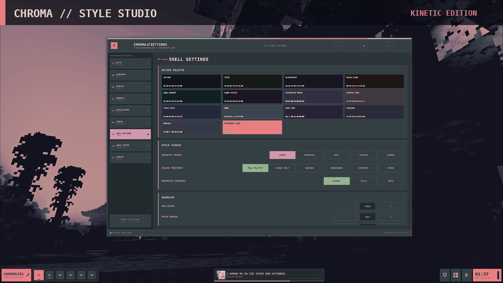

<div align="center">

# ✦ CHROMA ✦

**A vibrant, kinetic Quickshell desktop shell for Hyprland.**


<br />


<br /><br />


</div>

---

## ✦ CHROMA at a glance

<table>
<tr>
<td width="50%"><b>Style Studio</b><br />Sharp, Technical, Soft, Capsule and Hybrid geometry with coordinated Hyprland window rounding.</td>
<td width="50%"><b>Live desktop tools</b><br />Launcher, clipboard history, notifications, control centre, wallpaper selector, media and CAVA.</td>
</tr>
<tr>
<td><b>Real settings suite</b><br />Display management, application defaults, autostart, widgets, recovery, diagnostics and shell styling.</td>
<td><b>Cross-distro installer</b><br />A branded terminal installer for NixOS, Arch, Fedora and Ubuntu.</td>
</tr>
</table>

## ✦ Preview

<div align="center">


<br /><br />



</div>

## ✦ Features

- Theme-aware top bar with workspaces, media controls, album art, CAVA, utilities and clock
- Global geometry and colour systems shared by every CHROMA surface
- Safe display previews with Keep / Revert protection
- Application defaults, launcher favourites, hidden apps and user autostart management
- Searchable clipboard history with image previews and private mode
- Notifications, OSDs, control centre, theme browser and wallpaper selection
- Snapshot recovery, diagnostics, repair tools and Git-aware project status
- CLI controls plus an aesthetic cross-distro installer

## ✦ Install

```bash
bash <(curl -fsSL https://raw.githubusercontent.com/Aetherelic/chroma-shell/main/install.sh)
```

Preview the installer without changing anything:

```bash
git clone https://github.com/Aetherelic/chroma-shell.git
cd chroma-shell
./install.sh --local --dry-run
```

> CHROMA expects an existing Hyprland session. The installer deploys the shell and its integrations without replacing the rest of your desktop configuration.

## ✦ CLI

```bash
chroma start          # launch CHROMA
chroma restart        # restart the shell
chroma settings       # open settings
chroma launcher       # open the launcher
chroma clipboard      # open clipboard history
chroma doctor         # run diagnostics
chroma update         # update the installation
chroma uninstall      # remove managed files
```

## ✦ Status

| Area | State |
|---|:---:|
| Shell, bar and style engine | ✅ |
| Settings and display manager | ✅ |
| Applications and clipboard | ✅ |
| Recovery and diagnostics | ✅ |
| Cross-distro installer | ✅ |
| Declarative NixOS / Home Manager modules | 🚧 |

## ✦ Credits

<div align="center">

### CHROMA

Designed and developed by **Aetherelic**  
GitHub: [@Aetherelic](https://github.com/Aetherelic)

Built with Quickshell, Hyprland, Qt/QML, CAVA and the wider Linux desktop ecosystem.

</div>

## ✦ License

CHROMA is available under the [MIT License](./LICENSE).

---

<div align="center">

**Made with <3 by Aetherelic.**

</div>
