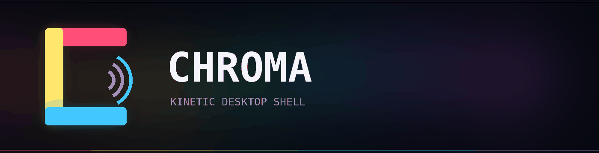
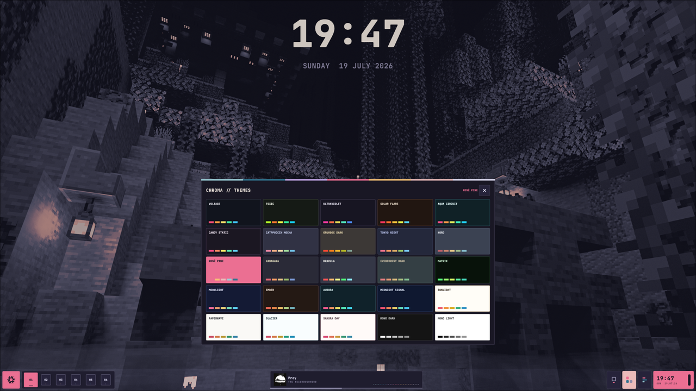
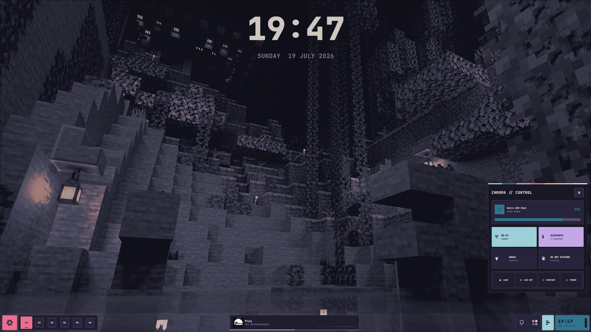
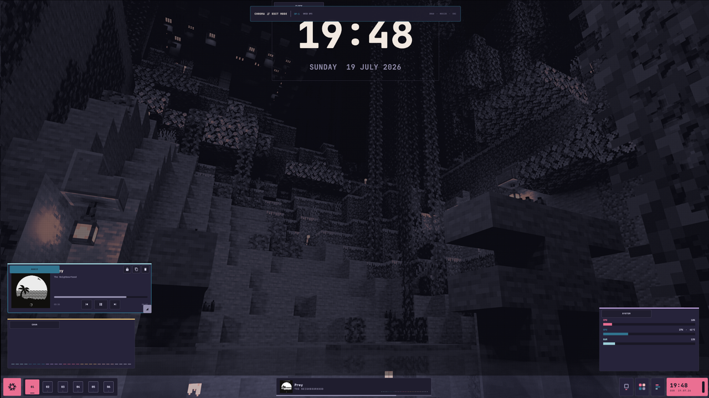
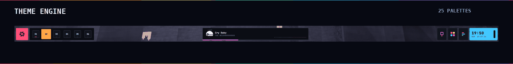
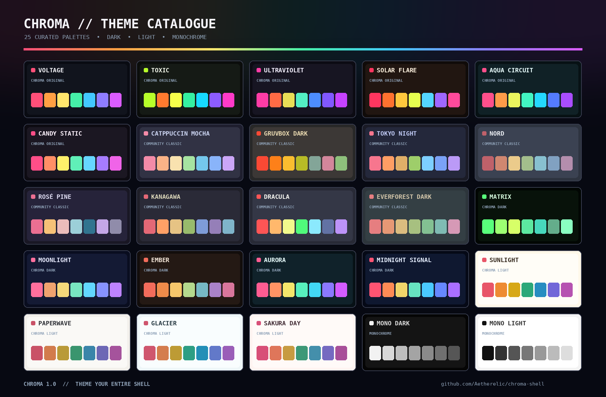

<div align="center">



<br />


<br />


<br /><br />

**A vibrant, modular desktop shell that turns Hyprland into a complete visual environment.**

Themes, widgets, settings, desktop tools and installation — designed as one coherent CHROMA system.

</div>

---

<div align="center">

</div>

## ✦ The shell at a glance

<table>
<tr>
<td width="50%"><b>Style Studio</b><br />Five geometry systems, coordinated Hyprland rounding, transparent or solid bars, live palettes and per-module control.</td>
<td width="50%"><b>Desktop Canvas</b><br />Draggable and resizable Music, CAVA, Clock and System widgets with per-monitor layouts.</td>
</tr>
<tr>
<td><b>System surfaces</b><br />Launcher, clipboard history, notifications, OSDs, theme browser, wallpaper selector and quick settings.</td>
<td><b>Real configuration</b><br />Display management, application defaults, autostart, diagnostics, snapshots and recovery.</td>
</tr>
</table>

## ✦ Settings suite

<div align="center">

</div>

The settings application manages the shell without reducing it to a pile of text files: Wi‑Fi, Bluetooth, displays, desktop widgets, applications, recovery, themes, shell geometry and system information all share one visual language.

## ✦ System surfaces

<div align="center">


<br />

</div>

## ✦ Theme engine

<div align="center">

</div>

<details>
<summary><b>Open the complete 25-theme catalogue</b></summary>

<br />

<div align="center">

</div>

<br />

| Family | Included palettes |
|---|---|
| **CHROMA Originals** | Voltage · Toxic · Ultraviolet · Solar Flare · Aqua Circuit · Candy Static |
| **Community Classics** | Catppuccin Mocha · Gruvbox Dark · Tokyo Night · Nord · Rosé Pine · Kanagawa · Dracula · Everforest Dark |
| **CHROMA Dark** | Matrix · Moonlight · Ember · Aurora · Midnight Signal |
| **CHROMA Light** | Sunlight · Paperwave · Glacier · Sakura Day |
| **Monochrome** | Mono Dark · Mono Light |

</details>

## ✦ Install

```bash
bash <(curl -fsSL https://raw.githubusercontent.com/Aetherelic/chroma-shell/main/install.sh)
```

Preview the installation plan without changing the system:

```bash
git clone https://github.com/Aetherelic/chroma-shell.git
cd chroma-shell
./install.sh --local --dry-run
```

> CHROMA expects an existing Hyprland session. The installer deploys its own isolated configuration and does not replace the rest of your desktop.

### Supported targets


## ✦ What ships

- Theme-aware bar with workspaces, centred media, CAVA, utilities, clock and optional solid background
- Desktop widget canvas with edit mode, resizing, snapping, fonts and per-monitor placement
- Safe display previews with Keep / Revert protection
- Application defaults, launcher favourites, hidden applications and user autostart management
- Searchable clipboard history, notifications, quick settings, wallpaper management and session controls
- Configuration snapshots, diagnostics, repair tools and Git-aware project status
- Six bundled CHROMA wallpapers installed without overwriting user files

## ✦ CLI

```bash
chroma start
chroma restart
chroma settings
chroma launcher
chroma clipboard
chroma widgets edit
chroma themes
chroma doctor
chroma update
chroma uninstall
```

## ✦ Editions

**CHROMA Kinetic** is the distribution-neutral shell available through this repository.

**CHROMA Kaizen** is the extended edition intended for [Kaizen Linux](https://github.com/Aetherelic/Kaizen-Linux), with deeper distribution integration.

## ✦ Credits

<div align="center">

### CHROMA

Designed and developed by **Aetherelic**  
GitHub: [@Aetherelic](https://github.com/Aetherelic)

Built with Quickshell, Hyprland, Qt/QML, CAVA and the wider Linux desktop ecosystem.

[MIT License](./LICENSE)

<br />

**Theme your system. Shape your shell.**

</div>
